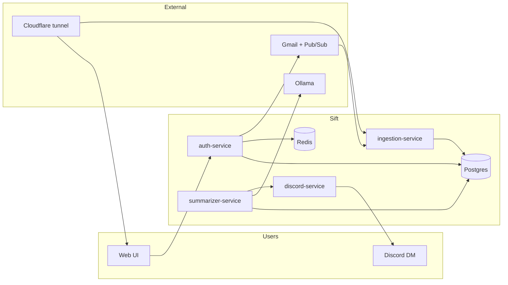

# Sift

Your inbox, sifted.

Sift watches the Gmail inboxes you link, keeps mail that would hurt to miss, and skips the rest. Once a day you get a digest on the web and in Discord too, if you want it there.

**Try it:** [https://sift.falaktulsi.com](https://sift.falaktulsi.com)  
**Live cluster status:** [https://grafana-sift.falaktulsi.com](https://grafana-sift.falaktulsi.com) (Prometheus + Grafana, anonymous Viewer)

### How it works

1. Create an account (username + password).
2. Link one or more Gmail inboxes.
3. Set your digest time (and timezone).
4. Optionally link Discord for DMs.
5. Add rules anytime: mute noise, always keep what matters, or ask about recent mail.

Digests always show up in the web app. Discord is optional delivery, not required to use Sift.

Gmail is only for linking inboxes (not for signing in). Forgot password uses your contact email (defaults to the first inbox you link).

Feedback: [Sift Feedback Form](https://docs.google.com/forms/d/e/1FAIpQLSfX5w7TvbwAQ61Zoq-vsr0weWSuwoeU_C-xmp92ipgvBIUi4A/viewform)

---

## Architecture




| Service              | Role                                                                 |
| -------------------- | -------------------------------------------------------------------- |
| `web-service`        | Next.js UI (proxies `/auth/*` and `/api/*`)                          |
| `auth-service`       | Register/login, sessions, Gmail OAuth link + watch renewer, REST API |
| `ingestion-service`  | Pub/Sub webhook → Gmail history → `ingested_messages`                |
| `summarizer-service` | Daily digest clock, rules, Ollama, retention                         |
| `discord-service`    | Optional bot DMs / slash commands                                    |
| Postgres + Redis     | Data + sessions                                                      |
| Cloudflare tunnel    | Public HTTPS into k3d Traefik                                        |


**Production** is k3d + Cloudflare tunnel. Compose is for local experiments only.

## Production (k3d)

```bash
cp .env.example .env   # or ./scripts/bootstrap.sh
# fill Discord, Google, SESSION_SECRET, TOKEN_ENCRYPTION_KEY, WEBHOOK_SECRET, CF_TUNNEL_TOKEN

make start-world              # create cluster, apply manifests, build & deploy
make sync-secrets-from-env    # .env → k8s secrets
make pubsub-point-at-public   # Pub/Sub → https://sift.falaktulsi.com/webhooks/gmail?token=…
```


| Surface       | URL                                                        |
| ------------- | ---------------------------------------------------------- |
| Public UI     | [https://sift.falaktulsi.com](https://sift.falaktulsi.com) |
| Host ingress  | [http://localhost:8088](http://localhost:8088)             |
| Gmail webhook | `POST /webhooks/gmail?token=<WEBHOOK_SECRET>`              |


Cloudflare public hostname for `sift.falaktulsi.com` must point at:

`http://traefik.kube-system.svc.cluster.local:80`

Day-to-day: `make sync-web` / `make sync-all`, `kubectl get pods`, [k8s/README.md](k8s/README.md), [docs/OPS.md](docs/OPS.md).

After a PC reboot: Docker AutoStart + task **Sift Ensure Up** (AtLogOn) run Ollama and `make ensure-up` - see [docs/OPS.md](docs/OPS.md#after-pc-reboot). Re-register with `make install-autostart`.

Schema: `infra/postgres/init.sql` (ConfigMap on first PVC). Auth also migrates columns on boot (`password_hash`, nullable `discord_id`, username uniqueness).

## Auth model

1. **Register / sign in** with username + password (bcrypt).
2. **Link Gmail** (OAuth) while signed in - one or more inboxes.
3. **Optionally link Discord** for DMs (share a server with the bot, or invite it).
4. Digests always appear in the web UI; Discord DMs only if linked.

## External setup

### Discord (optional delivery)

1. [Discord application](https://discord.com/developers/applications) → OAuth2 redirect: `https://sift.falaktulsi.com/auth/discord/callback`
2. Bot token + Message Content Intent if using DM commands
3. Set `DISCORD_SERVER_INVITE` / `DISCORD_BOT_INVITE` in `.env`

### Google (required for mail)

1. Gmail API + OAuth Web client; redirect: `https://sift.falaktulsi.com/auth/google/callback`
2. Pub/Sub topic (e.g. `SiftIncomingEmail`) + push subscription →
  `https://sift.falaktulsi.com/webhooks/gmail?token=<WEBHOOK_SECRET>`
3. Keep the subscription from expiring:
  `make pubsub-point-at-public`  
   (sets endpoint + never-expire; Pub/Sub cannot send custom headers, so auth is `?token=`)

### Public HTTPS

cloudflared runs **in-cluster**. Origin service: Traefik as above - not `web-service` alone (webhook path must reach ingestion).

**Hookdeck (legacy):** early laptop relay (`hkdk.events` → Compose ingestion) when there was no domain. Not used in prod. See [docs/OPS.md](docs/OPS.md).

## Digests & retention

- Fires at each user’s `digest_local_time` in their `timezone`
- Keep/skip + per-user rules; leftover mail via Ollama (`OLLAMA_URL` / `OLLAMA_MODEL`)
- Window capped at `DIGEST_MAX_MESSAGES` (default **400**)
- Bodies cleared after **30 days**; rows deleted after **90 days**
- Test endpoints (`/test-digest`, `/test-recent`, `/digest-logs`) only when `DIGEST_TEST_ENDPOINT=1` - **off in prod**

## Local Compose (optional)

For experiments without k3d:

```bash
./scripts/bootstrap.sh
# edit .env
docker compose up --build -d
```


| Surface   | URL                                                                                                                          |
| --------- | ---------------------------------------------------------------------------------------------------------------------------- |
| Web UI    | [http://localhost:3010](http://localhost:3010)                                                                               |
| Auth/API  | [http://localhost:3000](http://localhost:3000)                                                                               |
| Ingestion | [http://localhost:${INGESTION_HOST_PORT:-8080}/webhooks/gmail](http://localhost:${INGESTION_HOST_PORT:-8080}/webhooks/gmail) |


Do **not** run Compose Postgres and k3d Postgres against the same live data (two writers). Prod DB is the k3d PVC `postgres-pvc`; Compose volume `sift_postgres_data` is a cold backup after cutover.

## Repo layout

```
branding/                     Brand tokens (branding.yaml → sync-branding)
services/auth-service/        Username/password, OAuth link, Gmail watch, /api/*
services/web-service/         Next.js UI
services/ingestion-service/   Gmail webhook consumer
services/summarizer-service/  Digests, rules, ask, retention
services/discord-service/     Bot delivery
infra/postgres/               init.sql + schema.md
infra/hookdeck/               Legacy local webhook relay
k8s/manifests/                k3d manifests
k8s/README.md                 Cluster create / start-world / sync / promote
docs/OPS.md                   Health checks, Pub/Sub, tunnel, backups
scripts/bootstrap.sh          Creates .env from .env.example
```

Colors, logo mark, and email chrome come from `branding/branding.yaml` (`make sync-branding`). See `branding/README.md`.

## Secrets

Never commit `.env` or `k8s/.../secrets.local.yaml`. Tracked: `.env.example`, placeholder k8s secrets.

Rotate if leaked: Discord secrets, Google client secret, `SESSION_SECRET`, `TOKEN_ENCRYPTION_KEY` (relink all Gmail), `WEBHOOK_SECRET`, DB password, `CF_TUNNEL_TOKEN`.

OAuth tokens at rest: AES-256-GCM via `TOKEN_ENCRYPTION_KEY`.

## Ops

Day-to-day checks, Cloudflare, GCP Pub/Sub, Hookdeck (legacy), Discord, backups: **[docs/OPS.md](docs/OPS.md)**.  
Cluster promote / sync: **[k8s/README.md](k8s/README.md)**.