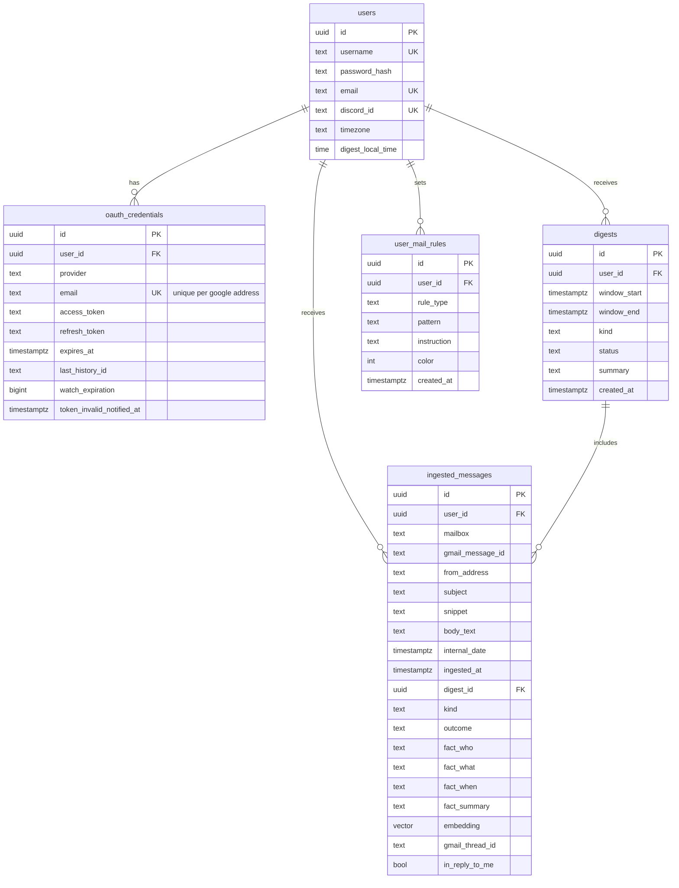

# Schema

```mermaid
erDiagram
    users ||--o{ oauth_credentials : has
    users ||--o{ ingested_messages : receives
    users ||--o{ digests : receives
    users ||--o{ user_mail_rules : sets
    digests ||--o{ ingested_messages : includes

    users {
        uuid id PK
        text username UK
        text password_hash
        text email UK
        text discord_id UK
        text timezone
        time digest_local_time
    }

    oauth_credentials {
        uuid id PK
        uuid user_id FK
        text provider
        text email UK "unique per google address"
        text access_token
        text refresh_token
        timestamptz expires_at
        text last_history_id
        bigint watch_expiration
        timestamptz token_invalid_notified_at
    }

    digests {
        uuid id PK
        uuid user_id FK
        timestamptz window_start
        timestamptz window_end
        text kind
        text status
        text summary
        timestamptz created_at
    }

    ingested_messages {
        uuid id PK
        uuid user_id FK
        text mailbox
        text gmail_message_id
        text from_address
        text subject
        text snippet
        text body_text
        timestamptz internal_date
        timestamptz ingested_at
        uuid digest_id FK
        text kind
        text outcome
        text fact_who
        text fact_what
        text fact_when
        text fact_summary
        vector embedding
        text gmail_thread_id
        bool in_reply_to_me
    }

    user_mail_rules {
        uuid id PK
        uuid user_id FK
        text rule_type
        text pattern
        text instruction
        int color
        timestamptz created_at
    }
```

