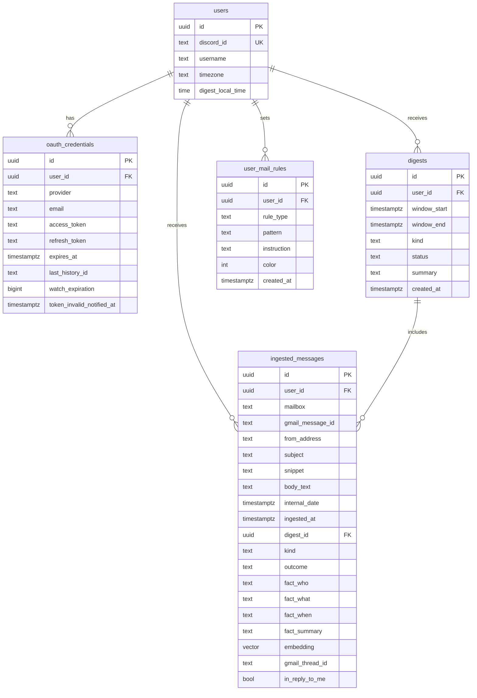

# Schema

`init.sql` is the source of truth. Update this mermaid when the schema changes.

Each user has a timezone and a local digest time (default 08:00). The summarizer fires at that civil time in that zone. Custom times are the same two columns on `/`.

A partial unique index on `(user_id, window_end)` where `kind = 'scheduled'` prevents a slot from running twice. Manual test digests are not on that index. Digest `kind` is `scheduled` or `manual`. Message `kind` is `notice` (keep) or `promo` (skip), not a taxonomy of email types. `in_reply_to_me` is true when Gmail's thread includes a message you sent — those are always kept. `user_mail_rules.rule_type` is `mute`, `always_show`, `job_filter`, or `instruction`. `instruction` is a digest-prompt fragment produced from a user Discord DM. `color` is an optional Discord embed color the user chose; unset means default grey. Bodies are cleared after 30 days; the rest of the row is deleted after 90. Optional `embedding` (pgvector, 768-d from Ollama `nomic-embed-text`) is used only as a backup for fuzzy insight questions; brand/from matches still win. The daily digest does not use it. Cursors live in `discord_rule_cursors` (keyed by `discord_id`, which maps to `users`).
